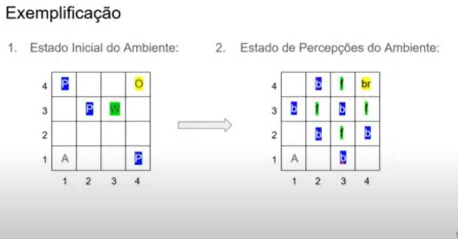

# wumpus-game-ia
## Mundo de Wumpus
<strong>É um exemplo do mundo simplificado,criado por Gregory Yob, 1973, para ilustrar o valor de um agente baseado em conhecimento e a 
representação do conhecimento</strong>
- É uma caverna formada por uma matriz 4x4, isto é 16 salas conectadas
- A caverna tem uma sala habitada por um monstro , o ¹Wumpus, que devora quem entrar na sala.
- Temos um ¹agente que avançará neste mundo;
- Há salas ue contém ¹poços, sem fundo, e se o agente cair neles, ficará preso para sempre;
- O Wumpus pode ser morto pelo ¹agente, mas o agente possui uma única ¹flecha;
- Em uma das salas existe a possibilidade de o agente encontrar uma barra de ¹ouro;
- Objetivo do agente é encontrar o ouro e sair da caverna sem cair no poco ou ser comido por Wumpus;
- O agente receberá uma ¹recompensa se sair com ouro e receberá uma ¹penalidade se for comido por Wumpus ou cair no poco
- Nas casas adjacentes a do Wumpus tem ¹fedor
- Nas casas adjacentes ao do poçõ tem ¹brisa
- O Wumpus pode ser morto pelo agente, se o agente estiver de frente para ele e atirar a flecha
- O Wumpus, ao ser atingido, emitirá um grito que será ouvido por toda a caverna.

## Ambiente:
- O agente começa sempre na sala [1,1];
- A barra de ouro e do Wumpus sao posicionados aleatoriamente,exceto na posicao[1,1];
- Os poços são posicionados aleatoriamente, exceto na posição [1,1], e nas salas da barra de ouro e do Wumpus

## Atuadores (do agente):
- Movimentação para norte, sul, leste, oeste;
- Pegar a barra de ouro
- Atirar a flecha
- # Observações: 
- As ações jamais ocorrem na diagonal;
- As ações impactam apenas uma única casa

## Sensores (do agente):
- Sentir 'fedor', se estiver em salas adjacentes ao Wumpus:
- Sentir 'brisa', se estiver em salas adjacentes aos pocos;
- Sentir 'impacto' ao bater em uma parede;
- Quando o Wumpus é atingido pela flecha, ele emite um 'grito' que é percebido em toda a caverna
- # Observação:
- As percepções jamais ocorrem na diagonal

## Imagens 

### Desenvolver o jogo "Mundo de Wumpus" é uma ótima maneira de explorar conceitos fundamentais de inteligência artificial, como busca em espaços de estado, planejamento, tomada de decisão e aprendizado. Aqui estão algumas ideias de como você pode usar esses conceitos para resolver ou mensurar problemas da vida real:

 1 - Planejamento de rotas: Use algoritmos de busca para encontrar a rota mais eficiente para um veículo autônomo se locomover em uma cidade. O agente pode evitar áreas congestionadas, ruas bloqueadas e outras condições adversas, similar à navegação do jogador no labirinto do "Mundo de Wumpus".

 2 - Otimização de cadeia de suprimentos: Aplique algoritmos de planejamento para otimizar a cadeia de suprimentos de uma empresa, minimizando os custos de transporte, tempo de entrega e armazenamento de mercadorias.

 3 - Controle de robôs em ambientes perigosos: Desenvolva algoritmos de controle para orientar robôs em ambientes perigosos, como locais de desastres naturais ou zonas contaminadas, garantindo que evitem obstáculos e perigos, assim como o jogador deve evitar o Wumpus no jogo.

 4 - Otimização de recursos em redes de energia: Utilize técnicas de planejamento para otimizar a distribuição de energia em uma rede elétrica, garantindo que a demanda seja atendida de forma eficiente e minimizando os custos operacionais.

 5 - Planejamento de tratamento médico: Desenvolva sistemas que ajudem os médicos a planejar tratamentos personalizados para pacientes, considerando fatores como histórico médico, condições atuais e melhores práticas clínicas.

 6 - Design de jogos educativos: Além de desenvolver o "Mundo de Wumpus", você pode criar outros jogos educativos que ensinem conceitos importantes de inteligência artificial, como aprendizado de máquina, redes neurais e algoritmos de busca.

 Essas são apenas algumas ideias para aplicar os conceitos aprendidos com o desenvolvimento do jogo "Mundo de Wumpus" em problemas da vida real. A inteligência artificial tem uma ampla gama de aplicações, e sua imaginação é o único limite!

